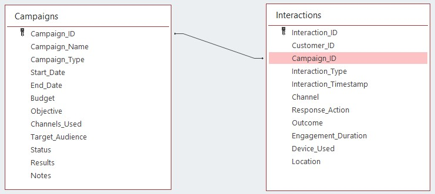

# Trabajo final
**NOTA:** Cada ejercicio correcto sumará 2.5 puntos (en total 10 puntos). Las preguntas de escribir código sólo serán puntuadas si el código ejecuta sin errores en MS SQL (en la versión de la web sqliteonline.com), en caso contrario será un cero. Podéis adjuntar capturas de pantalla para documentar mejor vuestras respuestas, pero tenéis que escribir código que luego yo pueda copiar y pegar para intentar ejecutarlo. Justificad vuestras respuestas y comentad vuestro código para que pueda entender vuestras respuestas. Tendréis que mandar vuestras respuestas en un único documento de Word por estudiante.

### Ejercicio 1
Diseña una base de datos relacional normalizada con dos tablas de la temática que quieras (¡cuánto más creativos seáis mejor!). Indica la relación entre las 2 tablas (si es 1 a 1, 1 a N o N a M) y justificar el porqué de esa relación.

**Respuesta:**

Las tablas de Campañas e Interacciones en una base de datos de marketing desempeñan roles complementarios. La tabla de Campañas almacena datos de cada campaña, mientras que la de Interacciones registra detalles de las interacciones individuales de los clientes con las campañas.




**La relación entre ambas es de uno a muchos.** Una campaña puede tener múltiples interacciones, pero cada interacción pertenece solo a una campaña. El identificador único (Campaign_ID) en la tabla de Campañas se utiliza como clave primaria, mientras que en la tabla de Interacciones, es una clave externa que referencia una campaña específica. 

Al combinar la información, los profesionales del marketing pueden: 
- comprender mejor el desempeño de las campañas, 
- identificar patrones de participación de los clientes, y 
- medir la efectividad de los canales y tácticas de marketing. 

Este enfoque basado en datos permite optimizar campañas, mejorar la participación de los clientes y alcanzar objetivos de marketing específicos.

### Ejercicio 2
Crea las dos tablas en SQL con un mínimo de 3 columnas por tabla con las PRIMARY KEYS y FOREIGN KEYS pertinentes. Crea una de las FOREIGN KEYS con la constraint ON UPDATE CASCADE. Añade 10 registros por tabla.

**Respuesta:**

Create table Campaigns setting column `Campaign_ID` as `PRIMARY KEY`

```sql
CREATE TABLE Campaigns (
Campaign_ID INT PRIMARY KEY,
Campaign_Name NVARCHAR(100),
Campaign_Type NVARCHAR(50),
Start_Date DATETIME,
End_Date DATETIME,
Budget DECIMAL(18, 2),
Objective NVARCHAR(100),
Channels_Used NVARCHAR(200),
Target_Audience NVARCHAR(200),
Status NVARCHAR(50),
Results NVARCHAR(200),
Notes NVARCHAR(MAX)
);
```

Create table Interactions setting column `Campaign_ID` as a `foreign key` with the constraint `ON UPDATE CASCADE`.

```sql
CREATE TABLE Interactions (
Interaction_ID INT PRIMARY KEY,
Customer_ID INT,
Campaign_ID INT,
Interaction_Type NVARCHAR(50),
Interaction_Timestamp DATETIME,
Channel NVARCHAR(50),
Response_Action NVARCHAR(100),
Outcome NVARCHAR(100),
Engagement_Duration INT,
Device_Used NVARCHAR(50),
Location NVARCHAR(100),
FOREIGN KEY (Campaign_ID) REFERENCES Campaigns(Campaign_ID) ON UPDATE CASCADE
);
```

Insert records into table Campaigns

```sql
INSERT INTO Campaigns (Campaign_ID, Campaign_Name, Campaign_Type, Start_Date, End_Date, Budget, Objective, Channels_Used, Target_Audience, Status, Results, Notes)
VALUES
    (1, 'Summer Sale 2023', 'Promotion', '2023-06-01', '2023-08-31', 5000.00, 'Increase sales during summer', 'Email, Social Media', 'All customers', 'Active', 'Increased sales by 20%', 'Successful campaign targeting summer products.'),
    (2, 'New Product Launch', 'Product Launch', '2023-09-15', '2023-09-30', 8000.00, 'Introduce new product line', 'Email, Website, Events', 'Targeted demographics', 'Completed', 'Generated buzz and high engagement', 'Successful launch of XYZ product line.'),
    (3, 'Holiday Season Campaign', 'Seasonal', '2023-11-01', '2023-12-31', 7000.00, 'Drive holiday sales', 'Social Media, Ads', 'Existing customers', 'Active', 'Expected ROI of 25%', 'Ongoing campaign for the holiday season.'),
    (4, 'Back-to-School Sale', 'Promotion', '2023-07-20', '2023-08-15', 4000.00, 'Attract students and parents', 'Email, Website', 'Students, parents', 'Completed', 'Reached targeted audience', 'Successful sale event for back-to-school supplies.'),
    (5, 'Spring Clearance', 'Clearance Sale', '2023-03-15', '2023-04-15', 3000.00, 'Clear out old inventory', 'Website, Ads', 'All customers', 'Completed', 'Sold 90% of clearance items', 'Effective in clearing out old inventory.'),
	(6, 'Winter Promo 2023', 'Seasonal', '2023-12-01', '2023-12-31', 4500.00, 'Boost winter sales', 'Email, Social Media', 'All customers', 'Active', 'Expected ROI of 15%', 'Ongoing campaign for the holiday season.'),
    (7, 'New Year Special', 'Promotion', '2023-12-25', '2024-01-05', 3000.00, 'Celebrate the new year', 'Email, Website', 'Targeted demographics', 'Active', 'Engagement rate increased by 25%', 'Special discounts for New Year celebrations.'),
    (8, 'Spring Launch Event', 'Product Launch', '2024-03-15', '2024-03-20', 6000.00, 'Introduce new products', 'Social Media, Events', 'Potential buyers', 'Planned', 'Anticipated product buzz', 'Upcoming event to showcase new products.'),
    (9, 'Summer Flash Sale', 'Promotion', '2024-07-01', '2024-07-03', 3500.00, 'Create urgency for purchases', 'Website', 'All customers', 'Planned', 'Expected high conversion rates', 'Limited-time discounts on selected items.'),
    (10, 'Fall Clearance', 'Clearance Sale', '2024-10-01', '2024-10-15', 2800.00, 'Clear out old inventory', 'Website, Ads', 'All customers', 'Planned', 'Inventory reduction strategy', 'Clearance sale for excess inventory.');
```

Insert records into table Interactions

```sql
INSERT INTO Interactions (Interaction_ID, Customer_ID, Campaign_ID, Interaction_Type, Interaction_Timestamp, Channel, Response_Action, Outcome, Engagement_Duration, Device_Used, Location)
VALUES
    (1, 101, 1, 'Click', '2023-06-10 09:30:00', 'Email', 'Clicked on product link', 'Engaged with product page', 60, 'Desktop', 'New York, USA'),
    (2, 102, 2, 'Open', '2023-09-16 15:20:00', 'Website', 'Opened promotional email', 'Visited product page', 120, 'Mobile', 'Los Angeles, USA'),
    (3, 103, 3, 'Purchase', '2023-11-05 18:45:00', 'Social Media', 'Made a purchase', 'Completed transaction', 0, 'Mobile', 'London, UK'),
    (4, 104, 1, 'Click', '2023-07-25 11:10:00', 'Email', 'Clicked on discount offer', 'Explored product options', 90, 'Desktop', 'Chicago, USA'),
    (5, 201, 6, 'Click', '2023-12-10 08:45:00', 'Email', 'Clicked on offer link', 'Engaged', 40, 'Desktop', 'San Francisco, USA'),
    (6, 202, 7, 'Open', '2023-12-28 17:20:00', 'Website', 'Opened promotion email', 'Engaged', NULL, 'Mobile', 'Chicago, USA'),
    (7, 203, 8, 'Purchase', '2024-03-18 11:30:00', 'Social Media', 'Bought product XYZ', 'Successful purchase', NULL, 'Mobile', 'London, UK'),
    (8, 204, 9, 'Click', '2024-07-02 10:00:00', 'Website', 'Clicked on flash sale link', 'Engaged', 25, 'Desktop', 'Paris, France'),
    (9, 205, 6, 'Open', '2024-10-05 09:15:00', 'Email', 'Opened clearance email', 'Engaged', NULL, 'Desktop', 'Berlin, Germany'),
    (10, 206, 3, 'Click', '2024-03-19 14:00:00', 'Events', 'Clicked on event post', 'Engaged', 30, 'Mobile', 'Tokyo, Japan');
```

### Ejercicio 3

Escribe el código que actualice un par de registros de la tabla maestra que aparezcan en la tabla con la FOREIGN KEY constraint ON UPDATE CASCADE y comprueba cómo efectivamente los registros de la tabla hija se actualizan automáticamente.

**Respuesta**

Actualizacion 1

```sql
UPDATE Campaigns
SET Campaigns.Campaign_ID = 11
WHERE Campaigns.Campaign_ID = 2;
```
Actualizacion 2

```sql
UPDATE Campaigns
SET Campaigns.Campaign_ID = 15
WHERE Campaigns.Campaign_ID = 8;
```

### Ejercicio 4

Escribe una query que una las 2 tablas con una INNER JOIN y luego escribe otra query con alguna OUTER JOIN. Explica con tus propias palabras qué datos quieres obtener con esta query. ¡Importante! Vuestras tablas tienen que estar conectadas con datos de un modo que no sea lo mismo hacer una INNER JOIN que una OUTER JOIN. Si veo que el INNER JOIN y el OUTER JOIN devuelven lo mismo os puntuare negativamente.

**Respuesta**

Inner Join

Seleccionar solo registros que tienen relación en ambas tablas. En este caso, las campanas que han tenido interacción.

```sql
SELECT Campaigns.Campaign_ID, Campaigns.Campaign_Name, Campaigns.Channels_Used, Interactions.Interaction_ID, Interactions.Interaction_Type, Interactions.Campaign_ID 
FROM Campaigns JOIN Interactions
ON Campaigns.Campaign_ID = Interactions.Campaign_ID;
```

Left Join

Seleccionar todos los registros de la tabla Campaigns y la información de la tabla Interactions solo para aquellos registros con una referencia validad a la tabla Campaigns.

```sql
SELECT Campaigns.Campaign_ID, Campaigns.Campaign_Name, Campaigns.Channels_Used, Interactions.Interaction_ID, Interactions.Interaction_Type, Interactions.Campaign_ID 
FROM Campaigns LEFT JOIN Interactions
ON Campaigns.Campaign_ID = Interactions.Campaign_ID;